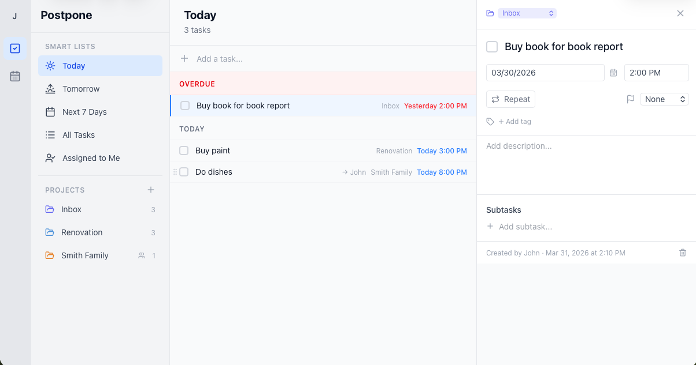
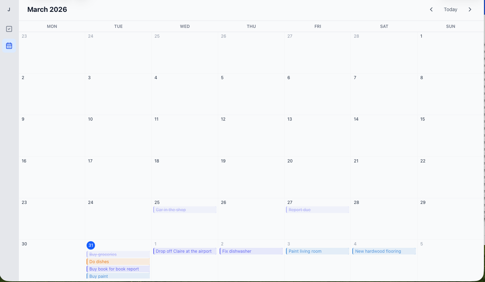
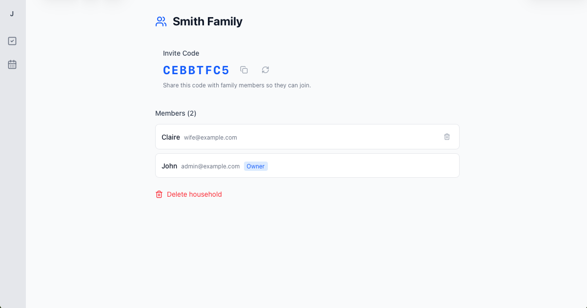

# Postpone

A self-hosted general purpose task manager. Built with .NET 10, React 19, and PostgreSQL.

Multiple user support where each user gets their own account (created by an admin), private projects by default, and the ability to collaborate by sharing projects with specific users or with a group via households.

## Today view


## Calendar view


## Household


## Features

### Task Management
- **Projects** — organize tasks into color-coded projects, each with their own task list
- **Smart Lists** — Today (with overdue grouping), Tomorrow, Next 7 Days, All Tasks, Assigned to Me
- **Calendar View** — month grid with drag-and-drop to reschedule tasks
- **Subtasks/Checklists** — break tasks into smaller steps with reordering
- **Recurring Tasks** — daily, weekly, monthly, yearly, or custom RRULE patterns with virtual instances (no database bloat). Skip, reschedule, or edit individual occurrences without affecting the rest of the series
- **Priority Levels** — none, low, medium, high with visual indicators
- **Due Dates** — with optional time; overdue tasks stay pinned in the Today view under a highlighted Overdue section
- **Multi-Day Tasks** — optionally set an end date to span a task across multiple days; the task renders as a continuous chip across each day in the calendar week view
- **Natural Language Input** — type dates inline when creating tasks: `tomorrow 5pm`, `next friday`, `tonight`, `apr 20`, `mon 9:30` — the date is parsed out and the task title is cleaned automatically
- **Task Assignment** — assign tasks to household members
- **Tags** — color-coded tags to categorize tasks across projects; create and assign tags from the task detail panel; navigate to a tag to see all tagged tasks; manage tags (create, rename, recolor, delete) from the sidebar
- **Dark mode** - Light or Dark mode, or Auto

### Collaboration
- **Households** — create a group and invite others via an 8-character invite code
- **Shared Projects** — link a project to a household so all members can see and edit tasks
- **Private by Default** — personal projects stay private unless explicitly shared
- **Real-Time Sync** — changes sync instantly across devices via SignalR WebSockets
- **Project Sharing** — share individual private projects with specific users

### User Management
- **Admin-Created Accounts** — no public registration; the admin creates all users
- **JWT Authentication** — access tokens (15 min) + rotating refresh tokens (1 year)
- **First-Run Setup** — on first launch, create your admin account directly in the browser

### Notifications
- **Pushover Integration** — receive push notifications for tasks due today, sent at a configurable hour (default 8 AM) in the user's own timezone
- **Overdue Notifications** — optional separate notification for overdue tasks; can be toggled and scheduled independently per user
- **Deduplication** — won't send the same notification twice
- **Multiple Notificatios** - Set notification to be sent in advance, customizable by user.

### Localization
- **9 Locales** — English, Íslenska, Dansk, Svenska, Norsk, Deutsch, Français, Español, Polski — locale selection controls date, time, and number formatting only (12-hour vs 24-hour clock, local date formats, etc.); the UI language is English
- **Per-User Timezone** — smart lists and notification scheduling use each user's configured timezone
- Set your preferred locale in **Settings → Appearance**

### Mobile & PWA
- **Mobile-First Design** — responsive layout with hamburger sidebar and full-screen modals on mobile
- **PWA Ready** — installable as a home screen app with offline caching via service worker

## Tech Stack

| Layer | Technology |
|-------|-----------|
| Backend | .NET 10 Web API, Entity Framework Core, Npgsql |
| Frontend | React 19, TypeScript, Vite 8, Tailwind CSS 4 |
| Database | PostgreSQL 17 |
| Real-Time | SignalR |
| Auth | JWT (access + refresh tokens), BCrypt |
| Notifications | Pushover API |
| Logging | Serilog |
| Validation | FluentValidation |
| Recurrence | iCal.NET (RRULE parsing) |
| Drag & Drop | @dnd-kit/react |
| HTTP Client | ky |
| Deployment | Docker Compose, nginx |
| Tunneling | Cloudflare Tunnel (cloudflared) |

## Security

- **Cloudflare Tunnel** — production compose uses `cloudflared` for inbound traffic; no host ports are exposed and your home IP is never revealed (see [cloudflare-tunnels.md](cloudflare-tunnels.md))
- **Non-root containers** — both the API and nginx containers run as unprivileged users
- **Security headers** — CSP, X-Content-Type-Options, X-Frame-Options, Referrer-Policy, Permissions-Policy
- **Secure cookies** — refresh tokens use HttpOnly, SameSite=Lax, and Secure (in production)
- **Rate limiting** — failed login attempts are rate-limited per IP (10 failures/min); other low-frequency auth endpoints use a global fixed-window limiter
- **Input validation** — all endpoints validated with FluentValidation
- **No SQL injection** — Entity Framework Core parameterized queries throughout
- **Password hashing** — BCrypt with automatic salting
- **Token rotation** — refresh tokens are rotated on use with reuse/theft detection

## Getting Started

### Prerequisites

- [Docker](https://docs.docker.com/get-docker/) and Docker Compose
- Or for local development: .NET 10 SDK, Node.js 22+, PostgreSQL 17

### Quick Start with Docker (local / development)

```bash
# Clone the repository
git clone <repo-url> && cd Postpone

# Configure environment
cp .env.example .env
# Edit .env and set secure values for DB_PASSWORD and JWT_SECRET

# Start the stack
docker compose up --build
```

The app will be available at:
- **Frontend**: http://localhost:3000
- **API**: http://localhost:5001
- **Health Check**: http://localhost:5001/health

### Production Deployment with Cloudflare Tunnel

`docker-compose.prod.yml` is designed for internet-facing deployments. It uses [Cloudflare Tunnel](cloudflare-tunnels.md) so **no ports need to be opened on your router or firewall** — `db` and `api` are only reachable inside the Docker network.

```bash
cp .env.example .env
# Edit .env — set DB_PASSWORD, JWT_SECRET, ADMIN_*, APP_URL, and CLOUDFLARE_TUNNEL_TOKEN

docker compose -f docker-compose.prod.yml up -d
```

See [cloudflare-tunnels.md](cloudflare-tunnels.md) for the full setup guide (creating a tunnel, configuring a public hostname, optional Cloudflare Access auth gate).

### First-Run Setup

On first startup with an empty database, you'll be greeted with a setup page to create your admin account. After logging in, go to **Admin** in the sidebar to create accounts for other users.

### Local Development

**Backend:**

```bash
cd src/Tasker.Api

# Make sure PostgreSQL is running (or use Docker for just the DB)
docker compose up db -d

# Run the API with hot reload
dotnet watch run
```

The API starts at http://localhost:5001 with Swagger UI enabled in development mode.

**Frontend:**

```bash
cd client
npm install
npm run dev
```

The dev server starts at http://localhost:5173 with API requests proxied to http://localhost:5001.

## Environment Variables

| Variable | Description | Default |
|----------|-------------|---------|
| `DB_PASSWORD` | PostgreSQL password | `changeme` |
| `JWT_SECRET` | JWT signing key (min 32 chars) | dev default |
| `PUSHOVER_API_TOKEN` | Pushover application API token | _(empty, notifications disabled)_ |
| `APP_URL` | Public frontend URL (used in password reset links and Pushover notification links) | `http://localhost:3000` |
| `CLOUDFLARE_TUNNEL_TOKEN` | Token from Cloudflare Zero Trust dashboard — required when using `docker-compose.prod.yml` | _(empty)_ |
| `DEFAULT_LOCALE` | Default locale for new accounts (`en`, `is`, `da`, `sv`, `nb`, `de`, `fr`, `es`, `pl`) | `en` |
| `DEFAULT_TIMEZONE` | Default IANA timezone for new accounts (e.g. `America/New_York`) | `UTC` |
| `ADMIN_EMAIL` | Pre-seed the initial admin email (skips first-run browser prompt) | _(empty)_ |
| `ADMIN_PASSWORD` | Pre-seed the initial admin password | _(empty)_ |
| `ADMIN_DISPLAY_NAME` | Pre-seed the initial admin display name | _(empty)_ |

## Architecture

**Local / development** (`docker-compose.yml`):

```
┌──────────────┐     ┌─────────────┐     ┌──────────────┐
│   Browser    │────▶│   nginx     │────▶│  .NET API    │
│  React SPA   │◀────│  (port 3000)│◀────│  (port 8080) │
│              │     │             │     │              │
│  SignalR  ◀──┼─────┼──WebSocket──┼─────┤  SyncHub     │
└──────────────┘     └─────────────┘     │              │
                                         │  EF Core ────┼──▶ PostgreSQL
                                         │              │
                                         │  Background  │
                                         │  Jobs:       │
                                         │  - Notify    │──▶ Pushover API
                                         └──────────────┘
```

**Production** (`docker-compose.prod.yml`) — no host ports exposed:

```
Internet ──▶ Cloudflare Edge ──▶ cloudflared container (outbound tunnel)
                                          │
                                          ▼  (Docker-internal network)
                                    ┌─────────────┐     ┌──────────────┐
                                    │   nginx     │────▶│  .NET API    │
                                    │  (client)   │◀────│  (api)       │
                                    │             │     │              │
                                    │  WebSocket──┼─────┤  SyncHub     │
                                    └─────────────┘     │              │
                                                        │  EF Core ────┼──▶ PostgreSQL
                                                        │  Background  │
                                                        │  Jobs:       │
                                                        │  - Notify    │──▶ Pushover API
                                                        └──────────────┘
```

**Data access is controlled by three paths:**
1. **Ownership** — you always see your own projects
2. **Direct Share** — a project owner can share with specific users
3. **Household Membership** — projects linked to a household are visible to all members

## API Endpoints

### Auth
| Method | Path | Description |
|--------|------|-------------|
| GET | `/api/auth/setup-status` | Check if first-run setup is needed |
| POST | `/api/auth/setup` | Create initial admin account |
| POST | `/api/auth/login` | Login (rate limited) |
| POST | `/api/auth/refresh` | Refresh tokens (rate limited) |
| POST | `/api/auth/logout` | Revoke refresh token |
| GET | `/api/auth/me` | Get current user profile |
| PUT | `/api/auth/me` | Update profile (name, timezone) |
| PUT | `/api/auth/me/password` | Change password |
| PUT | `/api/auth/me/pushover` | Set Pushover user key |
| PUT | `/api/auth/me/notification-preferences` | Update notification hour and overdue toggle |

### Admin
| Method | Path | Description |
|--------|------|-------------|
| GET | `/api/admin/users` | List all users |
| POST | `/api/admin/users` | Create user |
| PUT | `/api/admin/users/{id}` | Update user |
| DELETE | `/api/admin/users/{id}` | Delete user |

### Projects
| Method | Path | Description |
|--------|------|-------------|
| GET | `/api/projects` | List accessible projects |
| POST | `/api/projects` | Create project |
| GET | `/api/projects/{id}` | Get project |
| PUT | `/api/projects/{id}` | Update project |
| DELETE | `/api/projects/{id}` | Delete project |
| POST | `/api/projects/reorder` | Reorder projects |
| GET | `/api/projects/{id}/members` | List assignable members |
| POST | `/api/projects/{id}/share` | Share with user |
| DELETE | `/api/projects/{id}/share/{userId}` | Unshare |

### Tasks
| Method | Path | Description |
|--------|------|-------------|
| GET | `/api/projects/{id}/tasks` | List tasks in project |
| POST | `/api/projects/{id}/tasks` | Create task (accepts optional `endDate: yyyy-MM-dd`) |
| GET | `/api/tasks/{id}` | Get task |
| PUT | `/api/tasks/{id}` | Update task (accepts optional `endDate: yyyy-MM-dd`, `clearEndDate: bool`) |
| DELETE | `/api/tasks/{id}` | Soft delete task |
| POST | `/api/tasks/{id}/complete` | Mark complete |
| POST | `/api/tasks/{id}/uncomplete` | Mark incomplete |
| PUT | `/api/tasks/{id}/move` | Move to another project |
| POST | `/api/projects/{id}/tasks/reorder` | Reorder tasks in a project |
| PUT | `/api/tasks/{id}/due-date` | Update due date |
| PUT | `/api/tasks/{id}/recurrence` | Set recurrence rule |
| DELETE | `/api/tasks/{id}/recurrence` | Remove recurrence |

### Recurring Task Occurrences
| Method | Path | Description |
|--------|------|-------------|
| POST | `/api/tasks/{id}/occurrences/{date}/complete` | Complete a single occurrence |
| POST | `/api/tasks/{id}/occurrences/{date}/uncomplete` | Uncomplete a single occurrence |
| DELETE | `/api/tasks/{id}/occurrences/{date}` | Skip (delete) a single occurrence |
| PUT | `/api/tasks/{id}/occurrences/{date}` | Edit a single occurrence |
| PUT | `/api/tasks/{id}/occurrences/{date}/due-date` | Reschedule a single occurrence |

### Subtasks
| Method | Path | Description |
|--------|------|-------------|
| GET | `/api/tasks/{id}/subtasks` | List subtasks |
| POST | `/api/tasks/{id}/subtasks` | Create subtask |
| PUT | `/api/subtasks/{id}` | Update subtask |
| DELETE | `/api/subtasks/{id}` | Delete subtask |
| PUT | `/api/tasks/{id}/subtasks/reorder` | Reorder subtasks |

### Smart Lists
| Method | Path | Description |
|--------|------|-------------|
| GET | `/api/smart-lists/{type}` | Get smart list (today, tomorrow, next7days, all, assigned-to-me) |

### Calendar
| Method | Path | Description |
|--------|------|-------------|
| GET | `/api/calendar?start=&end=` | Get tasks in date range |

### Households
| Method | Path | Description |
|--------|------|-------------|
| GET | `/api/households` | List my households |
| POST | `/api/households` | Create household |
| GET | `/api/households/{id}` | Get household details |
| PUT | `/api/households/{id}` | Update household name |
| DELETE | `/api/households/{id}` | Delete household |
| POST | `/api/households/join` | Join via invite code |
| POST | `/api/households/{id}/regenerate-invite` | Regenerate invite code |
| GET | `/api/households/{id}/members` | List members |
| DELETE | `/api/households/{id}/members/{userId}` | Remove/leave member |

### Tags
| Method | Path | Description |
|--------|------|-------------|
| GET | `/api/tags` | List tags (includes active task count) |
| POST | `/api/tags` | Create tag |
| PUT | `/api/tags/{id}` | Update tag (name, color) |
| DELETE | `/api/tags/{id}` | Delete tag |
| GET | `/api/tags/{id}/tasks` | List active tasks with this tag |
| POST | `/api/tasks/{id}/tags` | Add tag to task |
| DELETE | `/api/tasks/{id}/tags/{tagId}` | Remove tag from task |

### Users
| Method | Path | Description |
|--------|------|-------------|
| GET | `/api/users` | List all other users (for sharing/assignment pickers) |

### Infrastructure
| Method | Path | Description |
|--------|------|-------------|
| GET | `/health` | Health check (DB connectivity) |

## Households & Sharing

1. **Create a household** from the Households page in the sidebar
2. **Share the invite code** with others — they enter it on the same page to join
3. **Create shared projects** — when creating a new project, select a household from the dropdown to make it visible to all members
4. **Assign tasks** — in shared projects, open a task's detail panel to assign it to any household member

## Pushover Notifications

1. Create a Pushover application at [pushover.net](https://pushover.net) and copy the API token
2. Set `PUSHOVER_API_TOKEN` in your `.env` file
3. Each user enters their personal Pushover user key in **Settings > Notifications**
4. Configure the notification hour and overdue notification toggle in **Settings → Notifications**

## Admin Password Reset

If the admin account is locked out, generate a one-time reset link directly from the server without needing to be logged in:

```bash
# Development
docker compose exec api dotnet Tasker.Api.dll generate-admin-reset-link

# Production
docker compose -f docker-compose.prod.yml exec api dotnet Tasker.Api.dll generate-admin-reset-link
```

This prints a URL valid for 24 hours. Paste it in a browser to set a new password.

If you have multiple admin accounts, specify which one by email:

```bash
docker compose exec api dotnet Tasker.Api.dll generate-admin-reset-link --email admin@example.com
```

By default the link uses `http://localhost:3000` as the base URL. Set `APP_URL` in your `.env` file to generate links with your actual domain:

```
APP_URL=https://your-domain.com
```

## Database

Postpone uses PostgreSQL 17 with EF Core migrations. Migrations run automatically on startup.

To create a new migration during development:

```bash
cd src/Tasker.Api
dotnet ef migrations add MigrationName
```

## Backup & Restore

Postpone ships with two shell scripts that wrap standard PostgreSQL tools. Run them from the project root. They work with both the dev and production compose files — set `COMPOSE_FILE` if needed:

```bash
# Production
export COMPOSE_FILE=docker-compose.prod.yml
```

### Backup

```bash
./scripts/backup.sh
```

Creates a timestamped SQL dump (e.g. `tasker_20260331-143000.sql`) in the current directory:

```bash
# Custom output path
./scripts/backup.sh /backups/tasker_before_upgrade.sql
```

The underlying command is:

```bash
docker compose exec -T db pg_dump -U tasker tasker > tasker_$(date +%Y%m%d-%H%M%S).sql
```

The `-T` flag disables pseudo-TTY allocation, which is required when running from cron or scripts.

### Restore

```bash
./scripts/restore.sh tasker_20260331-143000.sql
```

The script will:
1. Prompt for confirmation (data will be overwritten)
2. Stop the API container to prevent writes during restore
3. Drop and recreate the `tasker` database
4. Load the SQL dump
5. Restart the API (EF Core migrations run automatically on startup)

### Automated backups with cron

```cron
0 2 * * * cd /path/to/postpone && ./scripts/backup.sh /backups/tasker_$(date +\%Y\%m\%d-\%H\%M\%S).sql >> /var/log/postpone-backup.log 2>&1
```

Store backup files in a location outside the Docker volume — a mounted network share, object storage, or a separate disk — so they survive a `docker compose down -v`.

## License

MIT — see [LICENSE](LICENSE)
